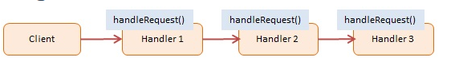

# Chain of Responsibility

## Diagram

## Participants

The objects participating in this pattern are:

- Client -- In sample code: `Request`
  - Initiates the request to a chain of handler objects
- Handler -- In sample code: `Request.get() method`
  - Defines an interface for handling the requests
  - Implements the successor link (returning 'this')
