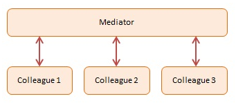

# Mediator

## Diagram

## Participants

The objects participating in this pattern are:

- `Mediator` -- In sample code: `Chatroom`
  - Defines an interface for communicating with Colleague objects
  - Maintains references to Colleague objects
  - Manages central control over operations

* `Colleagues` -- In sample code: `Participants`
  - Objects that are being mediated by the Mediator
  - Each instance maintains a reference to the Mediator
